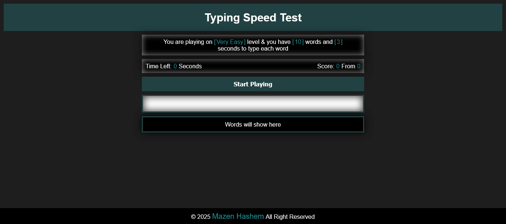
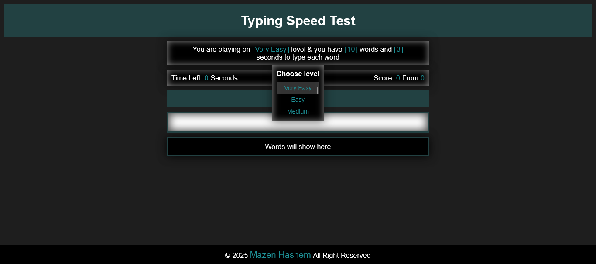
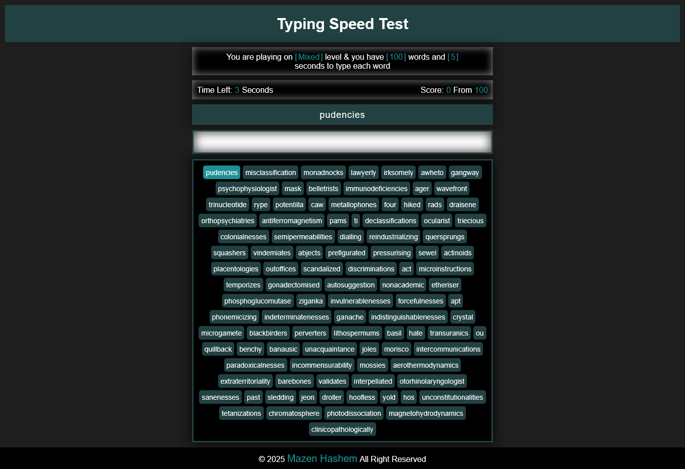
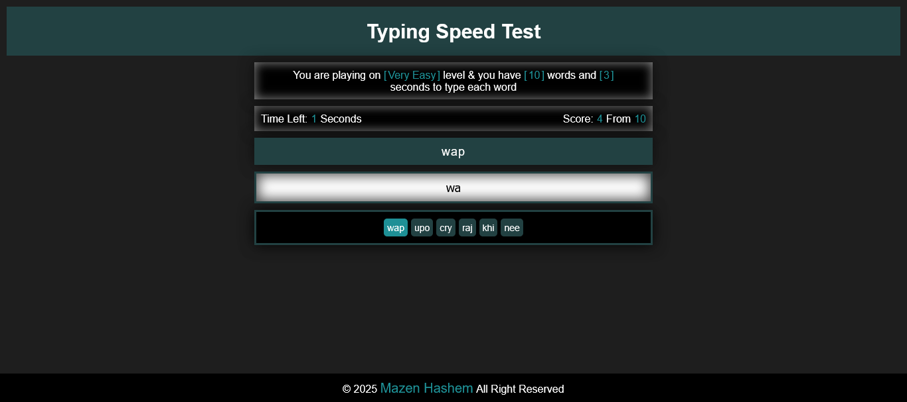
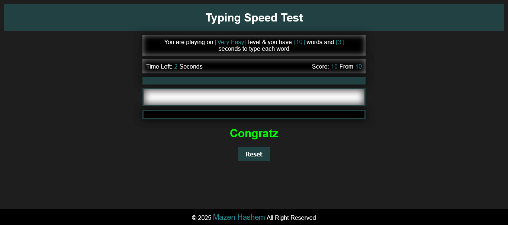
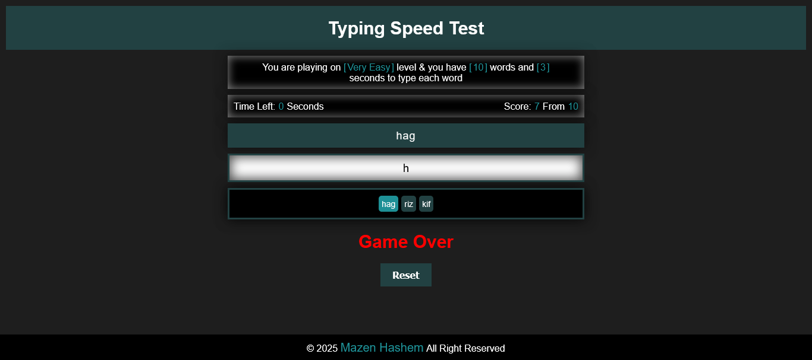

<h1>Typing Speed Test Game</h1>

  

<h2>Description</h2>

  This is a Typing Speed Test Game made by 
  <em>HTML</em> , 
  <em>CSS</em> and
  <em>JavaScript</em> languages.
  Inspired by 
  <strong>
    <a href="https://www.youtube.com/@ElzeroWebSchool">ElzeroWebSchool</a>
  </strong> 
  channel.

My goal from this project is to show my experience in Front-end web development.

<h3><u>Functionality:</u></h3>
<ul>
  <li>The game has levels from (very easy) to (impossible), and (mixed).</li>
  <li>Every level has number of words and timer by seconds.</li>
</ul>
<h4>On loading:-</h4>
<ul>
  <li>Default level is (very easy), and player can change it.</li>
  <li>Chosen level will fetch game data from local json file.</li>
  <li>After successful fetch, player will know number of words and timer, and start button will be ready.</li>
</ul>
<h4>On click start:-</h4>
<ul>
  <li>Timer will start immediately.</li>
  <li>Current word will appear instead of start button.</li>
  <li>All the words will appear in the black container.</li>
</ul>
<h4>While playing:-</h4>
<ul>
  <li>Timer will restart and player will get 1 point for each correct word.</li>
  <li>Player will loss if timer finished before write the word correctly.</li>
</ul>

>Please note: The console is locked.

<h3><u>Responsiveness:</u></h3>

  The website is responsive, it created to use across all devices, such as modern desktops, tablets, and phone browsers.

<h2>Screenshot</h2>
<h3><u>Start:</u></h3>

<h3><u>Game box:</u></h3>

<h3><u>Result:</u></h3>
<h4>Wining:-</h4>

<h4>Losing:-</h4>
